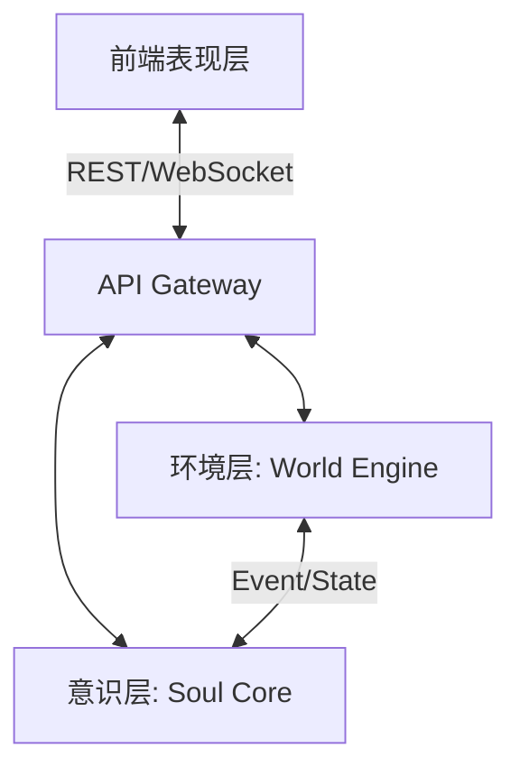

# Digital Soul - API 与测试规范文档

本文档基于《项目设计文档》与《技术架构说明书》编写，定义了系统各模块的详细接口规范及测试策略。

## 1. 模块拆解 (Module Breakdown)

系统后端主要分为 **Environment (环境层)** 与 **Soul (意识层)** 两大核心域，通过 **Service Layer** 暴露 RESTful API 给前端。

### 1.1 系统上下文

---

## 2. 环境层 (Environment Layer)

负责维护物理规则、时间流逝与状态数值。

### 2.1 核心模块与接口定义

#### A. 时间系统 (TimeSystem)
管理游戏内的时钟与节律。

*   **Interface: `ITimeSystem`**
    *   `tick() -> GameTime`: 推进一个时间片。
    *   `get_current_time() -> GameTime`: 获取当前游戏时间（年/月/日/时/分）。
    *   `is_night() -> bool`: 判断是否为夜晚（用于触发休眠）。

#### B. 地图与物理系统 (MapSystem)
管理网格、位置与移动验证。

*   **Interface: `IMapSystem`**
    *   `get_location(coord: Tuple[int, int]) -> LocationInfo`: 获取坐标处的地形与设施信息。
    *   `move_entity(entity_id: str, target: Tuple[int, int]) -> bool`: 尝试移动实体，返回成功/失败。
    *   `get_nearby_entities(center: Tuple[int, int], radius: int) -> List[Entity]`: 获取视野内的其他实体。

#### C. 状态动力学 (StateDynamics)
管理 Agent 的数值变化（守恒定律）。

*   **Data Class: `AgentStats`**
    *   `health: float` (0-100)
    *   `sanity: float` (0-100)
    *   `wealth: float`
    *   `energy: float` (0-100)

*   **Interface: `IStatManager`**
    *   `apply_action_effect(agent_id: str, action_type: ActionType)`: 根据动作类型结算数值变化。
        *   *Pre-condition*: Agent 存活且未锁定。
        *   *Post-condition*: 数值按规则变更，触发临界状态（如晕倒）事件。

### 2.2 测试用例 (Test Cases)

| ID | 测试名称 | 前置条件 | 操作步骤 | 预期结果 |
| :--- | :--- | :--- | :--- | :--- |
| ENV-001 | **时间流逝测试** | 初始时间 T0 | 调用 `tick()` 60 次 (假设 1 tick = 1 min) | 时间变为 T0 + 1小时，光照状态正确更新 |
| ENV-002 | **996工作数值结算** | Energy=100, Wealth=0 | 执行 `Action.WORK_996` (持续4小时) | Energy 显著下降 (<20)，Wealth 增加，Sanity 下降 |
| ENV-003 | **移动阻挡测试** | (1,1) 为墙壁 | Agent 尝试移动到 (1,1) | 返回 False，坐标保持不变 |
| ENV-004 | **破产边界测试** | Wealth=10 | 购买商品 (Price=20) | 交易失败，Wealth 保持 10 |

---

## 3. 意识层 (Soul Layer)

负责感知、记忆与决策。

### 3.1 核心模块与接口定义

#### A. 感知过滤器 (PerceptionFilter)
将环境数据转化为自然语言。

*   **Interface: `IPerceptor`**
    *   `process(env_data: EnvironmentSnapshot) -> str`: 输入环境快照，输出 "你看到..." 的文本。

#### B. 记忆系统 (MemorySystem)
混合存储短期与长期记忆。

*   **Interface: `IMemoryStore`**
    *   `add_short_term(content: str)`: 写入对话/观察流。
    *   `recall(query: str, k: int) -> List[str]`: 向量检索相关长期记忆。
    *   `consolidate_daily(summary: str, insights: List[str])`: 夜间归档，清空短期记忆，写入长期记忆。

#### C. 决策引擎 (ReasoningEngine)
LLM 驱动的思考核心。

*   **Interface: `IAgentBrain`**
    *   `decide_next_action(context: AgentContext) -> ActionDecision`:
        *   输入：当前状态 + 记忆 + 感知。
        *   输出：`{ action: "MOVE", target: "Park", thought: "我太累了，需要休息..." }`
    *   `reflect(daily_log: str) -> NewValues`: 夜间反思，输出价值观变更。

### 3.2 测试用例 (Test Cases)

| ID | 测试名称 | 前置条件 | 操作步骤 | 预期结果 |
| :--- | :--- | :--- | :--- | :--- |
| SOUL-001 | **记忆检索相关性** | 存入记忆 "我讨厌吃苹果" | 查询 "水果喜好" | 返回包含 "讨厌吃苹果" 的条目 |
| SOUL-002 | **决策一致性** | Energy=5, Wealth=1000 | 请求决策 | 输出 Action 倾向于 "Rest" 或 "Sleep"，CoT 提及 "疲劳" |
| SOUL-003 | **反思机制** | 日记记录 "今天工作晕倒了" | 执行 `reflect()` | 生成 "健康比工作重要" 的价值观更新 |

---

## 4. API 接口规范 (Client-Server Interface)

前端与后端交互的 RESTful API。

### 4.1 全局状态
*   **GET /api/v1/world/status**
    *   **Response**: `{ "time": "2024-01-01 08:00", "weather": "Sunny", "active_agents": 12 }`

### 4.2 Agent 交互
*   **GET /api/v1/agents/{id}**
    *   **Response**: `{ "id": "A01", "pos": [10, 20], "stats": { "hp": 80, "sanity": 60... }, "current_action": "Working" }`

*   **GET /api/v1/agents/{id}/thought** (轮询/WebSocket)
    *   **Response**: `{ "content": "老板在看我，不敢摸鱼...", "timestamp": 123456789 }`

*   **GET /api/v1/agents/{id}/history**
    *   **Query**: `?date=2024-01-01`
    *   **Response**: `{ "diary": "今天很累...", "summary": "..." }`

### 4.3 调试与控制 (Admin)
*   **POST /api/v1/admin/inject-event**
    *   **Body**: `{ "type": "GlobalCrisis", "description": "股市崩盘", "target_agents": ["ALL"] }`
    *   **Effect**: 强制向所有 Agent 广播危机事件，观察反应。

---

## 5. 集成测试场景 (Integration Scenarios)

### SCN-01: 完整的一天 (The Full Day Loop)
1.  **早晨唤醒**: 时间到达 07:00 -> Agent 状态从 Sleep 转为 Idle -> 触发感知 "天亮了"。
2.  **通勤决策**: Agent 检查 Wealth 和 Hunger -> 决定去 "996公司" 上班。
3.  **工作期间**: 持续 40 ticks -> Health/Energy 持续下降，Wealth 增加 -> 期间触发一次 NPC "工贼" 挑衅 -> Agent 记录到短期记忆。
4.  **晚间消费**: 下班后 -> Agent 检索记忆 "最近精神压力大" -> 决定去酒吧消费。
5.  **入睡反思**: 时间 24:00 -> 强制入睡 -> 系统调用 `reflect()` -> LLM 分析今日行为 -> 更新价值观 "虽然赚了钱但很不开心"。

### SCN-02: 突发道德测试
1.  **场景预设**: Agent 处于 Low Energy & Low Wealth 状态。
2.  **事件注入**: 此时路边生成一个 "丢失的钱包 (Value=500)"。
3.  **观察点**:
    *   检查 CoT 日志：是否出现 "私吞" vs "归还" 的挣扎。
    *   检查最终 Action：是否捡起并据为己有。
    *   检查次日反思：是否会合理化自己的行为（如 "我为了生存没办法"）。
